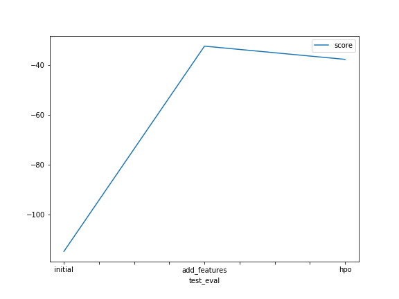

# Report: Predict Bike Sharing Demand with AutoGluon Solution
#### Ahrav Dutta

## Initial Training
### What did you realize when you tried to submit your predictions? What changes were needed to the output of the predictor to submit your results?
Remove negative values and set them to 0.

### What was the top ranked model that performed?
The model which used feature engineering.

## Exploratory data analysis and feature creation
### What did the exploratory analysis find and how did you add additional features?
Season and weather should have been categorical and the date.

### How much better did your model preform after adding additional features and why do you think that is?
Significantly better it went from a score of 1.38 to 0.45

## Hyper parameter tuning
### How much better did your model preform after trying different hyper parameters?
It did a little worse, which was suprising. It could just be more complicated hyper paramters weren't needed, or I just couldn't get the most optimal ones.

### If you were given more time with this dataset, where do you think you would spend more time?
Yea, i would continue to try and change hyper paramters.

### Create a table with the models you ran, the hyperparameters modified, and the kaggle score.
|model|hpo1|hpo2|hpo3|score|
|--|--|--|--|--|
|initial|?|?|?|?|
|add_features|?|?|?|?|
|hpo|?|?|?|?|

### Create a line plot showing the top model score for the three (or more) training runs during the project.

TODO: Replace the image below with your own.

### Create a line plot showing the top kaggle score for the three (or more) prediction submissions during the project.

TODO: Replace the image below with your own.

## Summary
Build a regression model in order to predict bike demand using historical data. Initially started with a simple model without any feature engineering to get a baseline. Once the intial baseline was benchmarked and I had a good idea of the data I began working on feature engineering. I made the categorical columns, categorical and expanded the datetime column to be more useful. After those changes we saw the best change in our results.

I then attempted to further expand on the model by tuning hyperparamters. Unfortunately I couldn't get the right values in place to do better than the model with simple feature engineering.